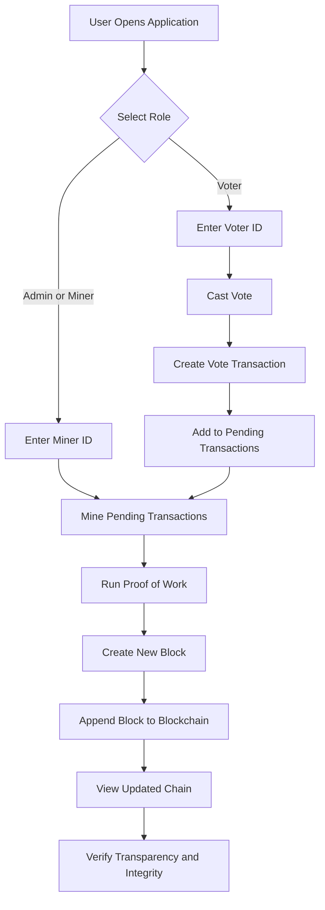

# BlockVote - Online Voting Using Blockchain

## Project Title
BlockVote - Online Voting Using Blockchain

## Description / Overview
BlockVote is a Python Flask application that demonstrates a blockchain-based electronic voting system.
Each vote is stored as a transaction and added to a block through a simple Proof-of-Work process.
The project focuses on transparency, tamper evidence, and educational understanding of blockchain voting architecture.

## Features
- Separate voter and admin/miner workflows
- Vote submission through web forms
- Pending vote transaction pool
- Proof-of-Work mining to create blocks
- Blockchain ledger retrieval endpoint
- Basic session-level duplicate voting checks
- Lightweight architecture for easy local testing

## Tech Stack
- Python 3
- Flask
- HTML5 and CSS3 templates
- requests
- hashlib, uuid, and time (Python standard libraries)

## Architecture / System Design

### Flowchart Diagram


### High-Level Design
- Frontend Layer: HTML templates in `templates/` for voter and admin interactions
- Application Layer: Flask routes in `main.py` for voting, mining, and chain display
- Blockchain Layer: `backend.py` for block structure, hashing, PoW, and chain operations
- Data Scope: In-memory demo data that resets when the server restarts

## Installation & Setup
1. Clone the repository
```bash
git clone https://github.com/suvadityaroy/Online-Voting-System-Using-Blockchain-Technology.git
cd Online-Voting-Using-Blockchain-main
```

2. Create a virtual environment
```bash
python -m venv .venv
```

3. Activate the environment
Windows PowerShell:
```powershell
.\.venv\Scripts\Activate.ps1
```
Windows CMD:
```cmd
.venv\Scripts\activate.bat
```
macOS/Linux:
```bash
source .venv/bin/activate
```

4. Install dependencies
```bash
pip install flask requests matplotlib pymysql
```

5. Run the application
```bash
python main.py
```

6. Open in browser
- Main page: http://localhost:5500/
- Voter page: http://localhost:5500/voter
- Chain endpoint: http://localhost:5500/chain/

## Author / Contact
Suvaditya Roy
- GitHub: https://github.com/suvadityaroy

Publication:
Ensuring Security and Transparency in E-Voting Systems Through Blockchain Technology
- Conference: ICDMIS 2024
- Publisher: Springer Nature (LNNS)
- DOI: https://link.springer.com/chapter/10.1007/978-981-96-6060-5_33
